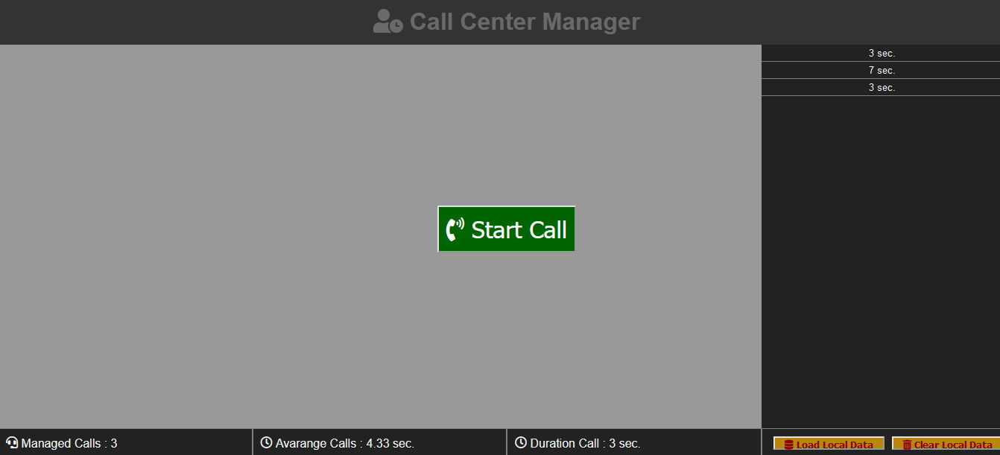

# Call Center Manager Js

## [english]
CCM is a small project for day-to-day "call center" call management, with the ability to recover data if the browser is accidentally refreshed or closed.
When starting a new session click on "clear local data", while to recover the data click on "load local data", easy.

## [italian]
CCM è un piccolo progetto per la gestione quotidiana delle chiamate di "call center", con la possibilità di recuperare i dati se il browser viene accidentalmente aggiornato o chiuso.
Quando si inizia una nuova sessione clicca su "clear local data", mentre per recuperare i dati clicca su "load local data", facile.

[CCM JS DEMO](https://marcellopagano.github.io/call-center-manager-js/)
